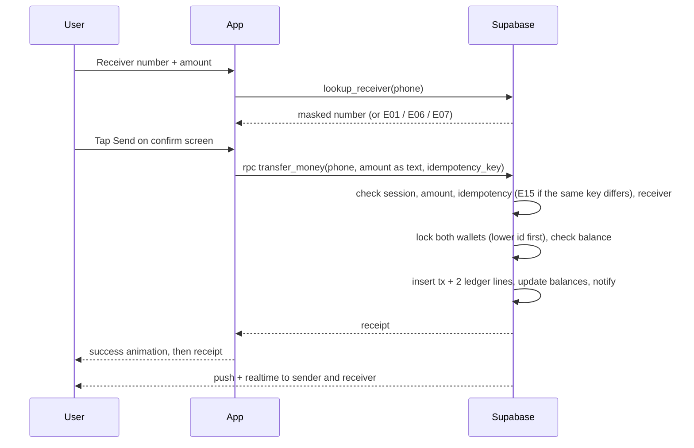

# SPEC.md — GaraadKaabeAI: System Requirements and Design

**Version:** 2.3 (24 Sep 2026). **Stack:** React Native + Expo, Supabase.

*2.1 changes:* secrets moved to a server-only `user_credentials` table; `recovery_locked_until` added; a deleted account's number can register again; the app has no access to `devices`, `app_sessions`, `audit_logs`.

*2.2 changes:* new error E15 "Request conflict" and test TC-40; `transfer_money` takes the amount as text and checks it before any rounding; `lookup_receiver` returns only the masked number; History and Receipt functions added; notification texts; limitation 5.

*2.3 changes:* the app is **English only**: Somali texts removed from §11, no language setting in Profile (FR-33), `app_users.language` dropped.

This file holds the **rules**: what the app must do and how it must behave. The **look** of each screen is in `design/screens/` and `design/screenshots/`. For how to build it, see `CLAUDE.md`.

---

## 1. Introduction

### 1.1 Purpose
GaraadKaabeAI is a mobile wallet that lets a registered user **send and receive money using only a phone number and a 4-digit PIN**. It is a portfolio and course project, inspired by WAAFI (Hormuud) and MyCash (Amtel).

### 1.2 Problem
Somali mobile-money apps are widely used, but their users report slow responses, server errors and outdated design. This project shows that the core function, moving money between two phone numbers, can be built **correctly, securely and fast**.

### 1.3 Scope

**In scope**
- Onboarding (3 slides)
- Register with phone number + 4-digit PIN
- Login with PIN **or** fingerprint
- Send money to a registered number; receive money automatically
- Balance, history, receipts
- In-app notifications and push notifications
- Profile: fingerprint on/off, change PIN, notifications on/off, log out, delete account
- Forgot PIN with a recovery code
- Auto-logout after 60 s with no touch, and when the app leaves the screen

**Out of scope:** agents (cash-in/out), merchants, QR pay, bill pay, airtime, cards, fees, admin dashboard, real bank or mobile-money integration.

### 1.4 Known limitations (state these in the README)
1. **Money is simulated.** A real wallet needs a Central Bank licence. Each new wallet gets a $100.00 demo balance.
2. **No OTP**, so the app cannot prove that a user owns the phone number they register.
3. **No PIN on send and no limits.** Anyone who unlocks a logged-in phone could send the whole balance within the 60-second window.
4. **If a user loses both their PIN and recovery code,** the account cannot be recovered.
5. **The server's 60-second idle rule covers function calls only** (send, lookup, history, receipts). Plain reads of the user's own rows (balance, notifications) and Realtime are not checked by the server; the app's 60-second no-touch logout covers them.

---

## 2. Users and roles

| Actor | What they do |
|---|---|
| User (as sender) | Registers, logs in, sends money, views history, manages profile |
| User (as receiver) | Receives money and a notification; no action needed |
| System (Supabase) | Checks PIN and device, moves money, locks accounts, expires sessions, sends notifications |

---

## 3. Functional requirements

*FR = something the app must do. Each ID is traced to a test case in Section 12.*

### Onboarding and registration
| ID | Requirement |
|---|---|
| FR-01 | First launch shows 3 onboarding slides (Skip, Next, Get started), then **Enter phone number**. Slide 1 is animated. |
| FR-02 | Accept only a Somali mobile number: 9 digits after +252 (e.g. 615552046). |
| FR-03 | If the number is already registered, go to **Login** (never Create PIN). |
| FR-04 | **Create PIN**, then **Confirm PIN**: exactly 4 digits, and both must match. |
| FR-05 | Reject weak PINs: the same digit four times (0000–9999), 1234, 4321, and the last 4 digits of the user's own number. |
| FR-06 | Show a **recovery code** once (XXXX-XXXX). Continue is disabled until the user ticks "I have written it down". |
| FR-07 | Offer **Enable fingerprint** (optional: Enable / Not now). |
| FR-08 | Credit a **$100.00 demo balance** via a ledger transfer from the System Treasury wallet. |
| FR-09 | The new user can send money **immediately**. |

### Login and session
| ID | Requirement |
|---|---|
| FR-10 | A returning user opens directly on **Login**. |
| FR-11 | The Login screen shows **two options**: *Login* with the PIN, or *Use your fingerprint* (only if enabled). It also shows "Not you?" and "Forgot PIN?". |
| FR-12 | PIN entry uses 4 visible boxes with a Show/Hide toggle (hidden by default) and an on-screen keypad. |
| FR-13 | 3 failed fingerprint scans fall back to the PIN. |
| FR-14 | Logging in on a **new phone** needs the PIN. It binds the new device, deactivates the old one and alerts the old device with a **"This wasn't me"** button (freezes the account). Sending works immediately. |
| FR-15 | Auto-logout after **60 s with no touch**. Every touch resets the timer. |
| FR-16 | Logout **immediately** when the app goes to the background or is closed. |

### Home
| ID | Requirement |
|---|---|
| FR-17 | Home shows a greeting with the masked number, bell (unread badge), settings, and balance card (hide/show). |
| FR-18 | Four action circles: **Send**, **Receive**, **History**, **Security**. |
| FR-19 | A "Your wallet number" card with **Share**. **Receive** opens a sheet showing the full number and **Copy number**. |
| FR-20 | Last 3 transactions with a hide-amounts toggle and **See all**. |
| FR-21 | Bottom tab bar on Home, History, Alerts and Profile: **Home · History · Alerts · Profile**. |

### Sending and receiving
| ID | Requirement |
|---|---|
| FR-22 | Send: receiver number + amount (quick amounts $5/$10/$20/$50). The system confirms the receiver is registered and active. |
| FR-23 | A confirm screen shows the masked receiver, amount, fee ($0.00), total and balance after, with **Send** and **Cancel**. |
| FR-24 | **No PIN is asked when sending** while logged in. **No per-send or daily limit**; the only cap is the balance. |
| FR-25 | Show the sending animation, then success, only after the server confirms. |
| FR-26 | Receipt: transaction ID, date/time, receiver, fee, new balance, status. |
| FR-27 | The receiver's balance updates live and they get a push and in-app notification. |

### History and notifications
| ID | Requirement |
|---|---|
| FR-28 | History: All / Sent / Received tabs, grouped by day, newest first; tapping a row opens its receipt. |
| FR-29 | Alerts: All / Money / Security tabs, grouped by day. Unread items are highlighted; tapping marks one read; **Mark all read** clears all. |

### Profile and account
| ID | Requirement |
|---|---|
| FR-30 | Profile is scrollable. It shows the number, member-since date and status. |
| FR-31 | Fingerprint login on/off. Turning it on requires the PIN. |
| FR-32 | Change PIN: requires the current PIN; the same weak-PIN rules apply. |
| FR-33 | Notifications on/off. |
| FR-34 | Log out. |
| FR-35 | **Delete this account** opens a confirmation sheet. Deletion is allowed **only when the balance is $0.00**; otherwise the button is disabled with an explanation. |
| FR-36 | Forgot PIN: phone + recovery code + new PIN twice. This issues a **new** recovery code, and the old one stops working. |
| FR-37 | If a new fingerprint is added to the phone, fingerprint login switches off until the user logs in with the PIN and turns it on again. |

---

## 4. Non-functional requirements

| ID | Area | Requirement |
|---|---|---|
| NFR-01 | Correctness | Money is never created or lost: the sum of all ledger entries is always 0. |
| NFR-02 | Security | PIN, recovery code and device secrets are stored only as **bcrypt hashes** on the server, in tables the app can never read (`user_credentials`, `devices`). The PIN is never stored on the phone. |
| NFR-03 | Security | HTTPS only. The Supabase `service_role` key never ships in the app. |
| NFR-04 | Security | Row Level Security on every table. Clients can never write to money tables directly. |
| NFR-05 | Performance | A send completes in under 3 seconds on 3G. |
| NFR-06 | Reliability | A network drop or double tap never causes a double send (idempotency key). |
| NFR-07 | Privacy | App content is hidden in the recent-apps preview, and screenshots are blocked on PIN screens. |
| NFR-08 | Privacy | Fingerprint data never leaves the phone. |
| NFR-09 | Usability | English only; touch targets at least 44 px; honour the "reduce motion" setting. |
| NFR-10 | Auditability | Every login, failed PIN, device change, transfer, freeze and deletion is logged. |

---

## 5. Screens

| # | Screen | Key contents |
|---|---|---|
| — | Onboarding 1–3 | Send in seconds (animated) · Your number is your wallet · Safe with PIN and fingerprint |
| 1 | Enter phone number | +252 field, Continue |
| 2 | Create PIN | 4 PIN boxes, Show/Hide, keypad, Continue (enabled at 4 digits) |
| 3 | Confirm PIN | Same as Create PIN, then Confirm PIN |
| 4 | Recovery code | Code, Copy, warning, "I have written it down" checkbox |
| 5 | Enable fingerprint | Benefits list, Enable / Not now |
| 6 | Login | Green header + number + "Not you?"; PIN boxes, keypad, Login, *or*, Use your fingerprint, Forgot PIN? |
| 7 | Home (tab) | Greeting, bell, settings, balance card, 4 action circles, wallet number card, 3 transactions |
| 8 | Send money | Balance chip, receiver field (verified), amount, quick amounts, Continue |
| 9 | Confirm sending | Summary card, warning, Send / Cancel |
| 9b | Sending | Coin-flying animation, then success (pop, tick, burst), View receipt / Back to Home |
| 10 | Receipt | Animated tick, details card, Done / View history |
| 11 | History (tab) | Segmented tabs, grouped list |
| 12 | Forgot PIN | Phone, recovery code, new PIN ×2, Reset PIN |
| 13 | Profile (tab) | Account card; Security, Preferences, About and Account sections; delete sheet |
| 14 | Alerts (tab) | Unread count, Mark all read, segmented tabs, grouped cards |

**Icons:** send = paper plane, receive = arrow into tray. Never diagonal arrows, which look like call-log icons.

---

## 6. Process flows

### 6.1 Register
1. The app calls `auth-check-phone`. If the number is new, the user creates and confirms a PIN.
2. The app generates a random **device secret** in SecureStore and sends phone, PIN and the device-secret hash to `auth-register`.
3. The server validates the PIN rules, hashes everything, and creates the auth user, `app_users` row, wallet, device and welcome bonus (a ledger transfer).
4. The server returns a session and the recovery code. The app shows the recovery code, then Enable fingerprint, then Home.

### 6.2 Login with PIN (same phone)
The server checks, in order:
1. account not locked or frozen
2. device active and device secret matches
3. PIN hash matches

On success it opens an `app_sessions` row and returns a session (kept in memory only). On failure it adds 1 to the fail count; 3 fails lock the account for 30 min, and 3 lockouts lock it for 24 h.

### 6.3 Login with fingerprint
1. The user taps **Use your fingerprint**.
2. The app reads the biometric-protected secret from SecureStore. The phone shows the fingerprint prompt, and the read succeeds only on a match.
3. The app sends that secret to `auth-biometric-login`. The server compares the hash and returns a session.
4. After 3 failed scans, the app falls back to the PIN.

*Plain English:* the fingerprint unlocks a locked drawer on the phone. Inside is a key the server recognises. The server sees the key, never the finger.

### 6.4 Login on a new phone
The user enters their number and the server says it is registered, so the app shows Login. The user enters the PIN and the app creates a new device secret. The server then:
1. deactivates the old device and binds the new one
2. alerts the old device with a **"This wasn't me"** button, which calls `account-freeze`

Sending works immediately.

### 6.4b Push notifications
1. After every successful login, the app requests notification permission, gets its **Expo push token** and saves it on its `devices` row (`device-register-push`).
2. When a transfer, security event or welcome happens, the server always inserts an in-app `notifications` row.
3. It sends a push (`send-push`) **only** to the user's **active** device, and **only** if Notifications is on in Profile.
4. New-device login: the server reads the **old** device's token **before** deactivating it and sends the "This wasn't me" alert there, never to the new device.
5. Logout and account deletion clear that device's `push_token`.

*Plain English:* the push token is the phone's postal address. Without it, the server has nowhere to deliver the message.

### 6.5 Send money

### 6.6 Forgot PIN
The user enters phone + recovery code + new PIN twice. The server compares the recovery-code hash (3 wrong tries lock recovery for 24 h), saves the new PIN, and issues a **new** recovery code, which the app shows once.

### 6.7 Auto-logout
| Trigger | Detected by | Result |
|---|---|---|
| 60 s with no touch | App timer, reset on every touch | Token cleared, Login shown |
| 60 s with no request | Server: `app_sessions.last_seen` | Requests rejected (E11) |
| App goes to the background | `AppState` change | Token cleared |
| App closed or killed | Token was only in memory | Next launch shows Login |
| Logout tapped | `auth-logout` | Session revoked |

### 6.8 Delete account
Profile → Delete this account → confirmation sheet. If the balance is greater than 0, the button is disabled and the sheet says to send the money out first. If the balance is 0, `account-delete` sets the status to `deleted` and the phone to NULL (the row is kept for audit), revokes devices and sessions, removes the Supabase auth user, and signs out. Because the phone is cleared, **the same number can register again** as a new account with a new wallet.

---

## 7. Security design

| # | Layer | Protects against |
|---|---|---|
| 1 | PIN hashed with bcrypt | A database leak revealing PINs |
| 2 | Weak-PIN blocking | Easy guesses like 1234 |
| 3 | Lockout: 3 wrong PINs → 30 min; 3 lockouts → 24 h | Guessing all 10,000 PINs |
| 4 | Device binding (device secret, hash on server) | Using the account from another phone |
| 5 | Old-device alert + "This wasn't me" freeze | A login on another phone going unnoticed |
| 6 | Confirm screen before every send | Wrong number or amount |
| 7 | Token in memory only, 60 s idle, logout on background | Session theft, unattended phone |
| 8 | HTTPS + RLS + no client writes to money tables | Tampered app or direct API calls |
| 9 | Balance check inside a locked transaction | Overdrawing the wallet |
| 10 | Audit log + notifications on both sides | Fraud going unnoticed |
| 11 | Fingerprint login via biometric-protected secret | Someone watching the PIN being typed |

**Why a 4-digit PIN is still acceptable here:** 10,000 combinations sounds small, but the lockout allows only about 3 guesses per 30 minutes, and the attacker also needs the bound phone.

---

## 8. Money logic

- **Double-entry ledger:** every transfer writes two ledger lines that sum to zero (e.g. −10.00 for the sender, +10.00 for the receiver). Ledger lines are never edited or deleted.
- **Cached balance:** `wallets.balance` is for speed only. It must always equal the sum of that wallet's ledger lines.
- **System Treasury wallet** (`type = system`): the only wallet allowed below zero. It funds the $100 demo balances, so the total stays exactly 0.
- **`transfer_money()` rules:**
  - runs in one transaction
  - locks both wallets with `FOR UPDATE`, lower id first (avoids deadlocks)
  - checks the balance after locking
  - checks the amount **as text before any rounding**: digits with at most 2 decimals, greater than 0 (E09)
  - uses a unique idempotency key: a repeated key with the **same** request (sender, amount, receiver) returns the first receipt; with a **different** request it fails with E15. The key is checked again after locking, so a double tap can never pay twice.
- **Money type:** `numeric(12,2)`, never float. Every ledger line also stores `balance_after`, the wallet balance right after it.

---

## 9. Database (Supabase / Postgres)

| Table | Columns | Rules |
|---|---|---|
| `app_users` | id, auth_user_id, phone, status, notifications_on, created_at | phone UNIQUE, 9 digits, NULL only when deleted; auth_user_id NULL only when deleted; status ∈ active / locked / frozen / deleted |
| `user_credentials` | user_id, pin_hash, recovery_hash, failed_pin_count, lockout_count, locked_until, recovery_failed_count, recovery_locked_until, updated_at | **server-only**; one row per user |
| `devices` | id, user_id, device_secret_hash, biometric_secret_hash, push_token, name, is_active, bound_at | **server-only**; one active device per user (partial unique index); push_token = Expo push token (the phone's delivery address) |
| `wallets` | id, user_id, type, balance, currency | type ∈ user / system; `type='system' OR balance >= 0` |
| `transactions` | id, reference, type, sender_wallet_id, receiver_wallet_id, amount, status, idempotency_key, created_at | reference UNIQUE; idempotency_key UNIQUE; amount > 0; sender ≠ receiver; one welcome bonus per wallet |
| `ledger_entries` | id, transaction_id, wallet_id, amount, balance_after, seq, created_at | insert-only; index (wallet_id, created_at); seq = exact order of lines |
| `notifications` | id, user_id, kind, title, body, read_at, created_at | kind ∈ sent / received / security / welcome |
| `app_sessions` | id, user_id, device_id, auth_session_id, last_seen, revoked | **server-only**; 60 s idle rule; auth_session_id = the login token's `session_id` |
| `audit_logs` | id, user_id, device_id, action, details (jsonb), created_at | **server-only**; insert-only |

**RLS summary**
- **Read:** users read only their own rows in `app_users`, `wallets`, `transactions`, `ledger_entries` and `notifications`. A deleted account sees nothing.
- **Server-only:** the app has no access to `user_credentials`, `devices`, `app_sessions` or `audit_logs`; only Edge Functions use them.
- **Update:** users update only `notifications.read_at` and their own `notifications_on` setting, enforced per column.
- **No client inserts or deletes** anywhere, and no writes at all to `wallets`, `transactions` or `ledger_entries`.
- `ledger_entries` and `audit_logs` reject UPDATE, DELETE and TRUNCATE for every role, including the server.

---

## 10. Backend interface

| Kind | Name | Input | Output |
|---|---|---|---|
| Edge Function | `auth-check-phone` | phone | registered: true/false |
| Edge Function | `auth-register` | phone, pin, device_secret, device_name | session, recovery_code |
| Edge Function | `auth-login` | phone, pin, device_secret | session |
| Edge Function | `auth-biometric-login` | phone, biometric_secret, device_secret | session |
| Edge Function | `auth-enable-biometric` / `auth-disable-biometric` | pin, biometric_secret | ok |
| Edge Function | `auth-reset-pin` | phone, recovery_code, new_pin, device_secret | session, new recovery_code |
| Edge Function | `auth-change-pin` | current_pin, new_pin | ok |
| Edge Function | `auth-logout` | — | ok |
| Edge Function | `account-freeze` | — (from the old-device alert) | ok |
| Edge Function | `account-delete` | — (balance must be 0) | ok |
| Edge Function | `device-register-push` | push_token | ok |
| Edge Function (internal) | `send-push` | user_id, title, body | sent / skipped (called by the server only) |
| Postgres RPC | `lookup_receiver` | phone | masked number (`61X XXX 2046`), or E01 / E06 / E07. A frozen account looks unregistered (E06). |
| Postgres RPC | `transfer_money` | receiver_phone, amount (string), idempotency_key | receipt (`money_item`), or E01 / E05–E11 / E15 |
| Postgres RPC | `my_transactions` | direction (all / sent / received), before_created_at, before_id, limit | History rows (`money_item`), newest first, other person's number masked |
| Postgres RPC | `get_receipt` | transaction_id | `money_item`, or null if not the caller's |
| Postgres RPC (server only) | `grant_welcome_bonus` | user_id | the $100.00 bonus (`money_item`); called by `auth-register`, only with `service_role` |
| Table read (RLS) | wallets, transactions, ledger_entries, notifications | — | own rows |
| Realtime | own `wallets` row, own `notifications` inserts | — | live updates |

---

## 11. Business rules and error messages

| Rule | Value |
|---|---|
| Demo balance | $100.00 |
| Minimum send | $0.01 |
| Maximum per send / per day | **No limit** (up to the balance) |
| Fee | $0.00 |
| Decimal places | 2 |
| Wrong PIN attempts before lock | 3 |
| Lock duration | 30 min; 24 h after 3 lockouts |
| Inactivity logout | 60 s |
| Waiting period after registering, new device or PIN reset | **None** |
| Delete account | Only at balance $0.00 |

| Code | When | Message |
|---|---|---|
| E01 | Invalid number | Enter a valid 9-digit number |
| E02 | PINs don't match | PINs do not match. Try again |
| E03 | Weak PIN | Choose a less obvious PIN |
| E04 | Wrong PIN | Wrong PIN. 2 attempts left |
| E05 | Account locked | Locked. Try again in 30 minutes |
| E06 | Receiver not found | This number is not registered |
| E07 | Send to self | You cannot send to your own number |
| E08 | Insufficient balance | Insufficient balance |
| E09 | Invalid amount | Enter a valid amount |
| E10 | Account frozen | This account is frozen |
| E11 | Session expired | Session ended. Enter your PIN |
| E12 | Network error | No connection. Check History before retrying |
| E13 | Fingerprint failed 3× | Fingerprint not recognized. Use your PIN |
| E14 | Delete with balance | Send your balance out before deleting |
| E15 | Same request key reused with a different amount or receiver | Request conflict. Start the payment again |

`money_item` (returned by the money functions): transaction_id, reference, created_at, type, direction (sent / received), amount, fee, counterparty_masked, balance_after, status.

**Notification texts** (stored when the event happens; they match the Notifications mockup):

| Kind | Text |
|---|---|
| sent | **Money sent** · You sent $10.00 to 61X XXX 4521. New balance $121.50. |
| received | **Money received** · You received $25.00 from 61X XXX 7710. |
| welcome | **Welcome to GaraadKaabeAI** · Your wallet is ready with a $100.00 demo balance. |

---

## 12. Test cases

| ID | Req. | Steps | Expected |
|---|---|---|---|
| TC-01 | FR-01 | Fresh install, open the app | Onboarding slide 1 (animated) |
| TC-02 | FR-10 | Registered user opens the app | Login screen |
| TC-03 | FR-02 | Enter 12345 | E01 |
| TC-04 | FR-04 | PIN 4829, confirm 4830 | E02, back to Create PIN |
| TC-05 | FR-05 | PIN 1234 | E03 |
| TC-06 | FR-06 | Try Continue without ticking the checkbox | Button disabled |
| TC-07 | FR-08 | Register a new user | Balance $100.00; ledger sum still 0 |
| TC-08 | FR-03, FR-14 | Reinstall, enter an existing number, correct PIN | Login succeeds; old device alerted; can send immediately |
| TC-09 | Security 3 | Wrong PIN 3 times | E05; locked 30 min |
| TC-10 | FR-22 | Send to an unregistered number | E06 |
| TC-11 | FR-22 | Send to own number | E07 |
| TC-12 | FR-24 | Send $150 with a $121.50 balance | E08 |
| TC-13 | FR-22 | Send $0, then $10.555 | E09 both times |
| TC-14 | FR-23–27 | Send $10 to a valid user | Confirm, animation, receipt; sender −10, receiver +10; both notified live |
| TC-15 | FR-24 | Send while logged in | No PIN asked |
| TC-16 | NFR-06 | Double-tap Send / retry with the same key | One transaction only |
| TC-17 | NFR-01 | Two $8 sends at once from a $10 wallet | Exactly one succeeds, one E08 |
| TC-18 | NFR-04 | Insert into `wallets` using the anon key | Rejected by RLS |
| TC-19 | NFR-04 | User A reads user B's transactions | Zero rows |
| TC-20 | FR-15 | No touch for 60 s | Logged out |
| TC-21 | FR-15 | Keep tapping for 2 min | Stays logged in |
| TC-22 | FR-16 | Press Home, reopen | Login shown |
| TC-23 | FR-16 | Swipe the app away, reopen | Login shown |
| TC-24 | Security 7 | Call `transfer_money` 61 s after the last request | E11 |
| TC-25 | FR-36 | Forgot PIN with the correct recovery code | New PIN works; new code issued; old code rejected |
| TC-26 | FR-14 | Tap "This wasn't me" on the old phone | Account frozen (E10) |
| TC-27 | FR-07, FR-11 | Enable fingerprint, reopen | Login shows both options |
| TC-28 | FR-11 | Tap Use your fingerprint, scan the correct finger | Home, no PIN typed |
| TC-29 | FR-13 | Scan a wrong finger 3 times | E13; PIN keypad |
| TC-30 | FR-37 | Add a new fingerprint in phone settings, reopen | Fingerprint off; PIN required |
| TC-31 | NFR-08 | Inspect network traffic during fingerprint login | No fingerprint data sent |
| TC-32 | FR-29 | Tap an unread alert; tap Mark all read | Item read; badge clears |
| TC-33 | FR-35 | Delete account with balance > 0 | Button disabled (E14) |
| TC-34 | FR-35 | Delete account with balance 0 | Account deleted; signed out; the old PIN no longer logs in; the number can register again as a new account |
| TC-35 | FR-32 | Change PIN with the wrong current PIN | Rejected, counts toward lockout |
| TC-36 | NFR-01 | After all tests: `SUM(ledger_entries.amount)` | 0; every balance = sum of its ledger lines |
| TC-37 | FR-27 | Send money to a user whose Notifications is ON (real phone, app closed) | Push appears on the receiver's lock screen |
| TC-38 | FR-33 | Receiver turns Notifications OFF, then receives money | No push; the item still appears in Alerts |
| TC-39 | FR-14 | Log in on phone B with the account from phone A | "This wasn't me" push arrives on phone A, not phone B |
| TC-40 | NFR-06 | Retry with the same idempotency key but a different amount or receiver | E15; no money moves |

---

## 13. Build plan

| Week | Work | Done when |
|---|---|---|
| 1 | Supabase schema, RLS, System Treasury (migration) | Migrations pushed; `npm run test:db` passes (TC-18, TC-19) |
| 2 | `transfer_money`, `lookup_receiver`, History/Receipt functions, DB tests, TC-17 concurrency script (Node, two connections) | TC-10 to TC-17, TC-24, TC-36 and TC-40 pass |
| 3 | Auth Edge Functions (register, login, lockout, new device, reset, change PIN) | TC-03 to TC-09, TC-25, TC-26, TC-35 pass |
| 4 | Expo setup: theme, fonts, shared components, onboarding, registration screens | Onboarding → Home works on a phone |
| 5 | Login (PIN + fingerprint), Home, tab bar, auto-logout | TC-02, TC-20 to TC-23, TC-27 to TC-30 pass |
| 6 | Send → Confirm → Sending → Receipt, History, Realtime | TC-14, TC-15 pass |
| 7 | Alerts, Profile, delete account, push (tokens + send-push), animations | TC-32 to TC-34 and TC-37 to TC-39 pass |
| 8 | Full test run, bug fixes, README (with limitations), demo video | All 40 test cases pass |

**Future work:** OTP verification, fees, agent cash-in/out, merchant QR payments, bill pay, admin dashboard, real payment integration through a licensed partner.
